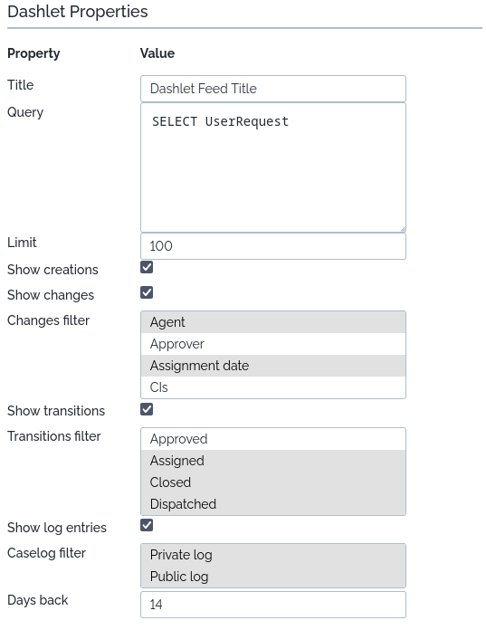
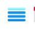
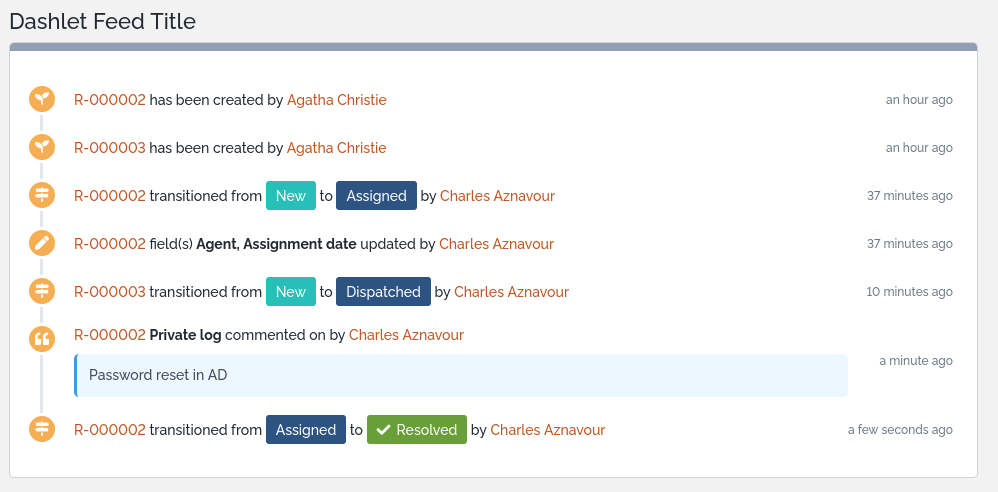

# AHalfWildSheep's Dashlet Feed
This extension brings to your iTop a new dashlet: DashletFeed.
DashletFeed provides an activity feed showing object changes, transitions, and log entries in chronological order all in one place with customizable filtering options.

## Dashlet Options

DashletFeed properties

* Title: A descriptive title
* Query: An OQL query to select which objects will be tracked (e.g., `SELECT UserRequest`)
* Limit: Maximum number of feed entries to display (default: 100)
* Show creations: Toggle to include object creation events in the feed
* Show changes: Toggle to include field change events in the feed
* Changes filter: Multi-select list of field to track changes for
* Show transitions: Toggle to include status transition events in the feed
* Transitions filter: Multi-select list of lifecycle states to track transitions for
* Show log entries: Toggle to include log comments in the feed
* Caselog filter: Choose which log new entries to display
* Days back: Number of days of historical data to include (default: 14)

## Installation

* Extract ahws-dashlet-feed to your extension folder
* Run a setup

You can now use this dashlet with the dashlet feed icon in your dashboard editor: 

## Example

## Compatibility
Min version is now  3.1.0 as I used the [`<themes_common>` XML node](https://www.itophub.io/wiki/page?id=latest:customization:xml_reference#158).
Legacy browser are [probably not supported](https://caniuse.com/flexbox) as I used Flexbox for display

Thanks to [icons8](https://icons8.com/) for their icons 👍